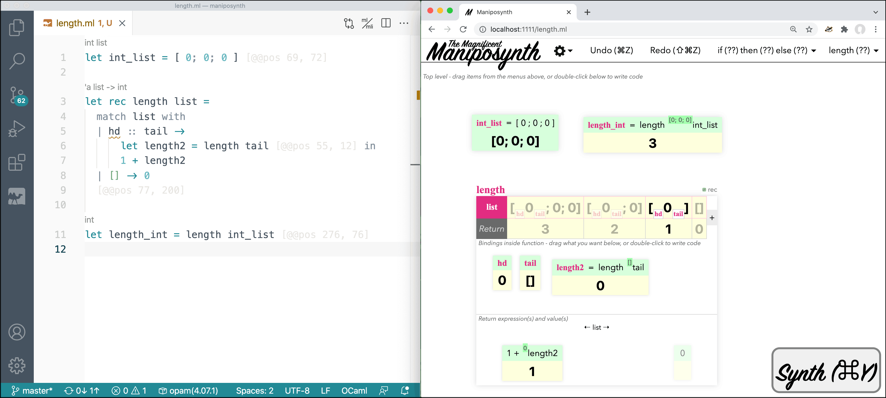

# 



Visual non-linear editing, live programming, and synthesis for (some of) OCaml.

[TOC]

## Download

You can grab a VM or a prebuilt binary. The Ubuntu VM includes the prebuilt binary and VS Code. The advantage of the VM is that VS Code is preconfigured with the OCaml language server and a special highlighting rule to dim AST annotations. The disadvantage of the VM is that it's a 1000x bigger download than the binaries. I also find graphical interaction in [VirtualBox](https://www.virtualbox.org/) to be rather clunky, even with hardware acceleration on. And the VS Code configuration is entirely optional, Maniposynth works with any text editor that will refresh when the file changes on disk (see below for how to enable this in Vim/Emacs if you prefer those editors).

**Pre-built binaries** (~5MB, effectively what we gave to user study participants):

- [Download MacOS Artifact](http://maniposynth.org/assets/maniposynth-artifact-mac.zip)
- [Download Linux x86_64 Artifact](http://maniposynth.org/assets/maniposynth-artifact-linux.zip)

**VM Image (with VS Code configured**)

- [Download OVA VM Image (~6.5GB)](https://maniposynth.s3.us-east-2.amazonaws.com/ManiposynthArtifact.ova). You shouldn't need it, but the username/password is maniposynth/maniposynth.

**Build from source (if the above fail)**

- [Download Source](http://maniposynth.org/assets/maniposynth-source.zip) (It should be easy to build. [Install opam](https://opam.ocaml.org/doc/Install.html) and then see the README.md in the source.)

## Quickstart

If you dowloaded the VM, there's an "Open Maniposynth" shortcut on the desktop that will start the Maniposynth server, open the `artifact` folder in VS Code, and open Maniposynth in Chromium on a `scratch.ml` file.

For the pre-built binaries, enter the `artifact` folder and start the server:

```
$ ./maniposynth
```

Then open Chrome and navigate to a file path relative to the server, e.g. [http://localhost:1111/examples/length.ml](http://localhost:1111/examples/length.ml). You can also create a new file (in your editor) and type that file path in the URL, e.g. [http://localhost:1111/scratch.ml](http://localhost:1111/scratch.ml).

Open up the same file in your editor, side by side, for the full bimodal experience.

If you have `ocamlformat` installed and in your `$PATH`, generated code will have better formatting, but this is not required.

## Live Refresh

VS Code will automatically refresh when code is changed on disk. For Vim and Emacs, see below:

### Vim

Thanks to [eli on Super User](https://superuser.com/a/1286322) for this solution. Run this in Vim:

```
:set autoread | au CursorHold * checktime | call feedkeys("lh")
```

After cursor stops moving, this will check every updatetime seconds for file changes, which is every 4 seconds by default. (More specifically, Vim waits for the cursor to stop moving for some time, then checks disk, then moves the cursor again with “lh” to retrigger and loop.)

To poll every half second instead of every 4 seconds:

```
:set updatetime=500
```

If you get annoying bells, [turn Vim’s bell off](https://unix.stackexchange.com/a/5313):

```
:set visualbell t_vb=
```

### Emacs

For Emacs, enable `global-auto-revert-mode`:

1. Hit F10 to go to the top menu
2. Options > Customize Emacs > Specific Option
3. Type `global-auto-revert-mode`
4. Move the cursor to `[ Toggle ]` and hit Enter
5. Move to `[ Apply and Save ]` and hit Enter


## Dimming AST Annotations (Optional)

To dim AST attribute annotations to make code more readable, in VS Code install the Highlight extension (fabiospampinato.vscode-highlight). This artifact includes a `.vscode/settings.json` that contains the regex and styling for annotations. It should "just work" if you open the artifact folder in VS code (e.g. via `code artifact`). You may have to edit the styling in `.vscode/settings.json` if you use a dark theme. (The VM is already configured with the Highlight extension.)

## Evaluating

We claim (a) that our artifact works as described in the Overview example in Section 2 of [the paper](http://maniposynth.org/assets/Maniposynth-Bimodal-Tangible-Functional-Programming-preprint.pdf), and (b) that our artifact works not just on the overview example.

To verify these claims, (a) we ask the artifact reviewers to follow the walkthrough in the paper Overview, including the variations, and (b) we ask the reviewers to try one example of their own choosing, either of their own design or from Table 1.

### Initial variation (Sec 2.1)

Start with a blank file. (Delete everything in your text editor and save.)

- [ ] Double-click on top-level canvas to add code.
- [ ] Type `[`, then autocomplete to `[0; 0; 0]` and hit Enter to select the autocomplete option, then Enter again to submit.
- [ ] Notice the new let-binding `int_list = [0; 0; 0]` on the canvas and in the code. This box is a tangible value (TV).
- [ ] Try repositioning the TV: hover the cursor near the edge of the box (a gray border should appear) and then drag the TV to a new position.
- [ ] Verify the TV moves, and a `[@pos ...]` attribute appears in the code.
- [ ] Double-click on the white canvas to add code, write `length int_list` and hit Enter.
- [ ] Notice the new function skeleton on the canvas and in the code.
- [ ] Double-click the pink-background `x1` and rename it to `list`.
- [ ] Drag `length (??)` from the toolbar at the top of the window into the subcanvas inside length (the whitespace below "Bindings inside function").
- [ ] Notice the new let-binding `length2 = length (??)`.
- [ ] Notice the `length` function is now recursive (`let rec length list = ...`).
- [ ] Notice that `length2` returns Bomb 💣 because it is currently an infinite loop (`length` calls itself with hole value, forever).
- [ ] Hover the cursor over the opening `[` on the input list in the IO grid, press `Destruct`.
- [ ] Notice the new `match` case split in the code, with two branches.
- [ ] Notice the pink `hd` and `tail` name subscripts on the input list  `[0; 0; 0]` in the IO grid.
- [ ] Notice the `hd` and `tail` pattern TVs on the subcanvas (below "Bindings inside function").
- [ ] Notice "⇠ list ⇢" and the two return TVs in the returns area ("Return expression(s) and value(s)"), one return for each branch.
- [ ] Drag the tail list (either the value `[0;0]` or the `tail` name) onto the `(??)` of `length (??)`.
- [ ] Notice in the code that `length2 = length tail` is now in a particular branch inside the `match` case split.
- [ ] Click on `[]` in the IO grid to focus the call frame for the base case.
- [ ] Notice that all the TVs in the function are grayed out, except for the return TV for that branch (which is still a hole `(??)`).
- [ ] Double-click that `(??)` and set it to `0`.
- [ ] Click `[0]` in the IO grid to bring the second-to-last call frame into focus.
- [ ] Double-click the remaining hole `(??)` and begin typing "1 + " (one space plus space).
- [ ] Notice the values have been colored.
- [ ] Autocomplete to the `0` that has the same color as the return from `length2 = length tail`.
- [ ] Notice that the return expression is now `1 + length2`.
- [ ] Notice in the IO grid that the function is producing the expected outputs for all inputs.

### Undo and delete (Sec 2.2)

This section claims that Undo works, and delete works on expressions and on let-bindings.

- [ ] Click some expression (black text on green background) and hit delete; verify it becomes `(??)`.
- [ ] Hit Undo; verify it undid.
- [ ] Click a let-binding TV such as `length2 = length tail`  (click the outer edge of a box to select the whole binding) and hit delete. If the binding is still used, it will become `(??)`.
- [ ] Delete the `length2` use, then try deleting the `length2` binding. Verify the let-binding disappears.

### Drag-to-extract (Sec 2.3)

- [ ] Undo until the `length` function contains only `length2 = length (??)` but no `match` statement. (Make sure the display refreshes between each time you click Undo, otherwise you may have to clear the file and start over.)
- [ ] Hover your cursor over the first `;` in the input list. `; 0; 0]` should be highlighted. Drag this into the `(??)` in `length (??)`.
- [ ] Notice that the `match` case split is inserted and the binding is now `length2 = length tail`.

### Autocomplete-to-extract (Sec 2.3)

- [ ] Undo until the `length` function exists, but is just an empty skeleton with no let-bindings.
- [ ] Double-click the return hole expression, type "1 + length " (one space plus space length space), and autocomplete to the `; 0; 0]` tail.
- [ ] Notice that the function is now nearly complete, except for a hole for the base case.

### Asserts (Sec 2.3)

- [ ] Clear the file in your text editor and save. (The browser should refresh to a blank canvas—if not, hit reload.)
- [ ] Double-click on top-level canvas and write `length [0; 0; 0] = 3`
- [ ] Notice that an assert is created (in addition to a skeleton for `length`).
- [ ] In the function IO grid, press the "+" button, and add an assert that given the input `[]` the output should be `0`. Hit enter.
- [ ] Notice another assert is created.
- [ ] Edit the return hole `(??)` to `0`  and notice one assert becomes satisfied.

### Program Synthesis (Sec 2.3)

- [ ] Undo until there is only one assert (`length [0; 0; 0] = 3`).
- [ ] Press "Synth".
- [ ] Notice the incorrect result (always returns 3 for each input).
- [ ] Press "Try again".
- [ ] Notice the correct result.
- [ ] Press "Accept".

### Subvisualizations, with asserts (Sec 2.3)

- [ ] Clear the file in your text editor and save. (The browser should refresh to a blank canvas— if not, hit reload.)
- [ ] Double-click and write `[0; 0; 0]`.
- [ ] Click on the literal output value (the opening `[` of the bold value below `int_list = [0; 0; 0]`)
- [ ] In the textbox next to the "Visualize" button, write `length` and press "Visualize"
- [ ] Notice the `?` subvisualization superscripts on the `[0; 0; 0]` value. (A length skeleton is also created.)
- [ ] Double-click the first `?` superscript, write 3 and hit Enter.
- [ ] Notice an assert is added, and a blue expected value `3` appears in the superscript.
- [ ] Similarly assert that the tail length should be `2` (rhe tail length is the third `?`.)
- [ ] Press Synth to produce the correct function, accept the result.
- [ ] Notice the superscripts on the `0` values have disappeared (they are no longer type-compatible with `length`.)
- [ ] Notice the first superscripts are rendered in green, indicated satisfied asserts.

### Try your own example

Pick a *simple* function of your choice and try to implement it—the easier exercises in Table 1 can be an inspiration. Final code for each example in Table 1 is included in the `artifact/examples` folder, if that is helpful. It is okay to perform text edits in your editor if you get stuck—this *is* a bimodal environment after all! Hints:

- Reminder: the expected way to create a new function is always to provide an example call, before the function exists.

- If you need a new type, double-click on the top-level canvas and write a valid OCaml type declaration. Here are the types used in the Table 1 examples (copy-paste of these may not work, you may have to retype manually or paste into your text editor):

  ```ocaml
  type nat = Z | S of nat
  type 'a ltree = Node of 'a ltree * 'a ltree | Leaf of 'a
  type 'a btree = Node of 'a btree * 'a * 'a btree | Empty
  ```

- If you are using such a custom type, remember that the toolbar at the top will contain example values that you can drag onto your canvas or into a subexpression (hover your cursor over the down arrow ▾).

- The synthesizer is unlikely to guess an if-then-else expression correctly. Drag the `if (??) then (??) else (??)` skeleton from the  first toolbar menu into your code and at least fill in the conditional.

- More inspiration: the following single asserts will synthesize the correct function with no extra information. One trick is using uncommon constants so that the synthesizer will not guess constant literals (e.g. `17`):

  ```ocaml
  fold ( + ) [ 1; 2; 3 ] 11 = 17
  map succ [ 1; 2; 3 ] = [ 2; 3; 4 ]
  list_sum [ 10; 20; 30 ] = 60
  ```

  (Copy-paste may not work, you may have to retype the above.)

  To verify the function is correct, it's helpful to rename the arguments (double-click the pink names).

## Bugs to know

- Pasting code that was copied from a rich-text source often fails. You will have to retype the code manually or try pasting into a plain text buffer and recopying.

- The positioning code is still not great—don't fight too much with trying to reposition things if they do not end up where you want. If something "disappears", it was probably bumped further down the page.

- If the page fails to render at all, there is likely a major type error or syntax error in your code. You will have to repair the file in your text editor and then refresh the browser. The Maniposynth terminal output *may* provide a hint as to what's wrong.

- The undo history does not remember edits that happened in the text editor.

- The synthesizer does not follow the same non-linear semantics as the rest of Maniposynth, so synthesis on a sketch will fail if a hole is not already inside the appropriate branch. For example, despite being partway to the goal, the following sketch will fail to synthesize because the synthesizer will not move `length2` into the branch:

  ```ocaml
  let rec length list =
    let length2 = length (??) in
    match list with hd :: tail -> (??) | [] -> (??)
  ```

  Delete the `length2` binding, or fill in the recursive call manually, and synthesis will succeed.

*Have fun!*
